# Bangkok Traffy ML Pipeline - Visual Overview

## Complete Pipeline Flow

```mermaid
flowchart TD
    Start[Start Pipeline] --> Scraping{Scrape New Data?}
    
    %% Scraping Phase
    Scraping -->|Yes| Weather["Scrape Weather Data\nOpen-Meteo API"]
    Scraping -->|Yes| AirQuality["Scrape Air Quality\nPM2.5, PM10, O3, NO2"]
    Scraping -->|No| LoadRaw
    Weather --> LoadRaw
    AirQuality --> LoadRaw
    
    %% Data Loading Phase
    LoadRaw[Load Raw Data]
    LoadRaw --> Traffy["Load bangkok_traffy.csv\n~700K complaints"]
    LoadRaw --> WeatherRaw["Load weather CSVs\nhourly data"]
    LoadRaw --> AirRaw["Load bangkok-air-quality.csv\ndaily data"]
    
    %% Cleaning Phase
    Traffy --> CleanTraffy["Clean Traffy Data\nDrop nulls, Filter Bangkok\nParse timestamps"]
    WeatherRaw --> AggWeather["Aggregate Weather\nHourly to Daily averages"]
    AirRaw --> CleanAir["Clean Air Quality\nDrop SO2 CO\nParse dates"]
    
    %% Merging Phase
    CleanTraffy --> ExtractDate["Extract Date\nYYYY-MM-DD"]
    AggWeather --> MergeStep1["Merge on Date\nTraffy + Weather"]
    ExtractDate --> MergeStep1
    MergeStep1 --> MergeStep2["Merge on Date\n+ Air Quality"]
    CleanAir --> MergeStep2
    
    %% Preprocessing Phase
    MergeStep2 --> ParseTypes["Parse Complaint Types\nConvert to list"]
    ParseTypes --> FilterEmpty["Filter Empty Types\nRemove invalid complaints"]
    FilterEmpty --> DropNulls["Drop Missing Data\nWeather and Air quality nulls"]
    
    %% Feature Engineering Phase
    DropNulls --> ExtractTime["Extract Time Features\nhour, day_of_week, month"]
    ExtractTime --> Cyclical["Cyclical Encoding\nhour_sin/cos, day_sin/cos\nmonth_sin/cos"]
    Cyclical --> Location["Location Features\nlatitude, longitude\ndistrict one-hot"]
    Location --> CreateTargets["Create Binary Targets\ntype columns"]
    
    %% Save & Decision Point
    CreateTargets --> SaveFinal["Save Final Dataset\ntraffy_weather_final.csv\n20-30 features"]
    SaveFinal --> TrainDecision{Train Models?}
    
    %% Training Phase
    TrainDecision -->|No| End[Pipeline Complete]
    TrainDecision -->|Yes| TrainLoop[Train Models Loop]
    
    TrainLoop --> CheckSamples{"Enough Samples?\nmin 50 positive"}
    CheckSamples -->|No| SkipType[Skip This Type]
    CheckSamples -->|Yes| HandleImbalance["Handle Class Imbalance\nSMOTE if ratio >10\nOversample if ratio >3"]
    
    HandleImbalance --> HyperparamSearch["Hyperparameter Search\nRandomizedSearchCV\n5 iterations, 3-fold CV"]
    HyperparamSearch --> TrainModel["Train Random Forest\nBest parameters selected"]
    TrainModel --> Evaluate["Evaluate Model\nAccuracy, Precision\nRecall, F1"]
    Evaluate --> SaveModel["Save Model\ntype_xxx_model.pkl"]
    
    SaveModel --> MoreTypes{More Types?}
    SkipType --> MoreTypes
    MoreTypes -->|Yes| TrainLoop
    MoreTypes -->|No| SaveSummary["Save Training Summary\ntraining_summary.csv"]
    
    SaveSummary --> End
    
    %% Styling
    classDef scrapeClass fill:#FFE5B4,stroke:#FF8C00,stroke-width:2px
    classDef loadClass fill:#E0F2F7,stroke:#0288D1,stroke-width:2px
    classDef cleanClass fill:#F0F4C3,stroke:#9E9D24,stroke-width:2px
    classDef mergeClass fill:#E1BEE7,stroke:#7B1FA2,stroke-width:2px
    classDef featureClass fill:#C8E6C9,stroke:#388E3C,stroke-width:2px
    classDef trainClass fill:#FFCDD2,stroke:#C62828,stroke-width:2px
    classDef decisionClass fill:#FFF9C4,stroke:#F57F17,stroke-width:3px
    
    class Weather,AirQuality scrapeClass
    class Traffy,WeatherRaw,AirRaw,LoadRaw loadClass
    class CleanTraffy,AggWeather,CleanAir,ParseTypes,FilterEmpty,DropNulls cleanClass
    class MergeStep1,MergeStep2,ExtractDate mergeClass
    class ExtractTime,Cyclical,Location,CreateTargets,SaveFinal featureClass
    class TrainLoop,HandleImbalance,HyperparamSearch,TrainModel,Evaluate,SaveModel,SaveSummary trainClass
    class Scraping,TrainDecision,CheckSamples,MoreTypes decisionClass
```



## Pipeline Phases Summary

| Phase | Input | Output | Key Operations |
|-------|-------|--------|----------------|
| **1. Scraping** | APIs | Raw CSV files | Weather + Air Quality data collection |
| **2. Extraction** | Raw CSVs | Cleaned DataFrames | Load, parse, validate data types |
| **3. Merging** | 3 DataFrames | 1 Unified DF | Join on date, ~540K records |
| **4. Preprocessing** | Merged Data | Clean Dataset | Filter invalids, drop nulls, ~500K records |
| **5. Feature Engineering** | Clean Data | Model-Ready Features | Temporal encoding, location, targets |
| **6. Training** | Features + Targets | Trained Models | Multi-label classification, per-type models |

## Key Data Transformations

### Row Count Changes
```
Raw Traffy Data:        ~700,000 complaints
├─ After Bangkok filter: ~650,000
├─ After type filter:    ~600,000
├─ After weather merge:  ~540,000
├─ After air quality:    ~500,000
└─ Final dataset:        ~500,000 records
```

### Column Evolution
```
Initial: 15 columns (raw complaint data)
↓
After Merge: 30 columns (+ weather + air quality)
↓
After Features: 50+ columns (+ temporal + location encoding)
↓
Final: 20-30 feature columns (cleaned for training)
```

## Execution Commands

```bash
# Full pipeline
python main.py

# Skip data collection
python main.py --skip-scraping

# Skip ETL (use existing merged data)
python main.py --skip-etl

# Skip training
python main.py --skip-training

# Fast training (sampled data)
python main.py --sample 200000 --n-iter 5
```
